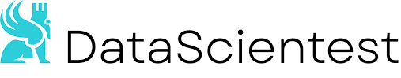
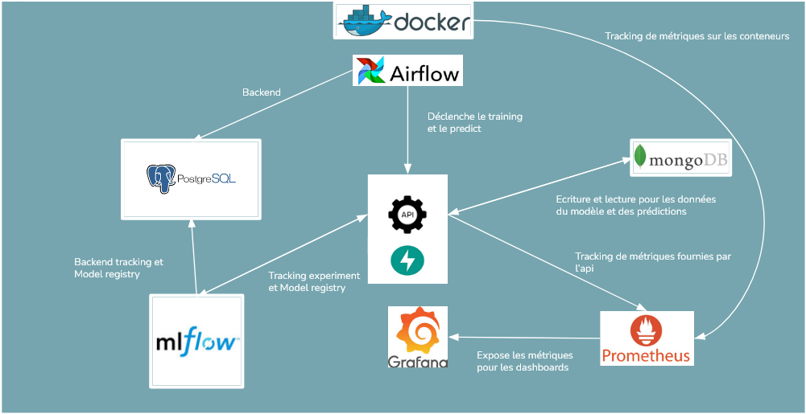

<!-- Improved compatibility of back to top link: See: https://github.com/othneildrew/Best-README-Template/pull/73 -->
<a id="readme-top"></a>
<!--
*** Thanks for checking out the Best-README-Template. If you have a suggestion
*** that would make this better, please fork the repo and create a pull request
*** or simply open an issue with the tag "enhancement".
*** Don't forget to give the project a star!
*** Thanks again! Now go create something AMAZING! :D
-->


<!-- PROJECT SHIELDS -->
<!--
*** I'm using markdown "reference style" links for readability.
*** Reference links are enclosed in brackets [ ] instead of parentheses ( ).
*** See the bottom of this document for the declaration of the reference variables
*** for contributors-url, forks-url, etc. This is an optional, concise syntax you may use.
*** https://www.markdownguide.org/basic-syntax/#reference-style-links
-->
[![Contributors][contributors-shield]][contributors-url]
[![project_license][license-shield]][license-url]
[![LinkedIn][linkedin-shield]][linkedin-url]


<!-- PROJECT LOGO -->
<br />
<div align="center">
  <a href="https://github.com/DataScientest-Studio/mar25_cmlops_rakuten">
    
  </a>

<h3 align="center">mar25_cmlops_rakuten</h3>

  <p align="center">
    Datascientest MLOps Training Projet : Challenge Rakuten
    <br />
    <a href="https://github.com/DataScientest-Studio/mar25_cmlops_rakuten/tree/dev_GP"><strong>Explore the docs »</strong></a>
    <br />
  </p>
</div>


<!-- TABLE OF CONTENTS -->
<details>
  <summary>Table of Contents</summary>
  <ol>
    <li>
      <a href="#about-the-project">About the project </a>
      <ul>
        <li><a href="#built-with">Built with</a></li>
        <li><a href="#app-global-architecture">APP global architecture </a></li>
      </ul>
    </li>
    <li>
      <a href="#getting-started">Getting Started</a>
      <ul>
        <li><a href="#prerequisites">prerequisites</a></li>
        <li><a href="#installation">installation</a></li>
      </ul>
    </li>
    <li><a href="#project_organization">Project Organization</a></li>
    <li><a href="#usage">Usage</a></li>
    
    <li><a href="#license">License</a></li>
    <li><a href="#contact">guillaumepedron@hotmail.com</a></li>
  </ol>
</details>


<!-- ABOUT THE PROJECT -->
## About The Project

<br />
<div align="center">
  
  </a>

This repo contains the work that has been done for my Datascientest MLOps training camp final project. It relies on the challenge data : https://challengedata.ens.fr/challenges/35. 
The challenge consists of a multimodal classification task on a large product catalog from the Rakuten marketplace.
For each product, the objective is to predict its corresponding Rakuten product type class based on both its textual description and associated image.
Additionally, it's important to note that the target classes in the training dataset are imbalanced.

<p align="right">(<a href="#readme-top">back to top</a>)</p>


[Optuna-badge]: https://img.shields.io/badge/Optuna-EEE.svg?style=for-the-badge&logo=optuna&logoColor=black
[Optuna-url]: https://optuna.org/

[PyTorch-badge]: https://img.shields.io/badge/PyTorch-EE4C2C.svg?style=for-the-badge&logo=pytorch&logoColor=white
[PyTorch-url]: https://pytorch.org/

[Torchvision-badge]: https://img.shields.io/badge/Torchvision-FF9900.svg?style=for-the-badge
[Torchvision-url]: https://pytorch.org/vision/

[product-screenshot]: images/datascientest.png
[app-architecture-screenshot]: images/architecture_app_rakuten.png


### Built With

<p align="center">
  <a href="https://www.python.org/"></a>
  <a href="https://www.docker.com/"></a>
  <a href="https://airflow.apache.org/"></a>
  <a href="https://www.postgresql.org/"></a>
  <a href="https://www.mongodb.com/"></a>
  <a href="https://grafana.com/"></a>
  <a href="https://github.com/google/cadvisor"></a>
  <a href="https://mlflow.org/"></a>
  <a href="https://optuna.org/"></a>
  <a href="https://pytorch.org/"></a>
  <a href="https://pytorch.org/vision/"></a>
</p>

<p align="right">(<a href="#readme-top">back to top</a>)</p>

### APP global architecture 

<br />
<div align="center">
  
  </a>
<!-- GETTING STARTED -->
## Getting Started

These instructions will help you set up the project in a local environment using Docker and Docker Compose. All services (ML pipeline, database, monitoring, etc.) are containerized for easy reproducibility.

### Prerequisites

To run this project, you need to have the following tools installed:
- **Git**  
  Install Git from https://git-scm.com
  Or via terminal:
  ```sh
  sudo apt-get install git  
  ```
- **Docker & Docker-compose** 
  Install Docker from https://www.docker.com/get-started
 

### Installation

1. Clone the repo
   ```sh
   git clone https://github.com/DataScientest-Studio/mar25_cmlops_rakuten/tree/dev_GP.git
   ```
2. Access to the project folder and launch docker
   ```sh
   cd mar25_cmlops_rakuten
   docker-compose up --build
   ```
   This will:

    - Build and start all services defined in docker-compose.yml

    - Install dependencies for training and inference

    - Launch Airflow, MLflow, PostgreSQL, MongoDB, Prometheus, Grafana, etc.

3.  Access the services via browser

  | Service              | Port local               | URL                                                    |
  |----------------------|--------------------------|--------------------------------------------------------|
  | MLflow UI            | `5000`                   | [http://localhost:5000](http://localhost:5000)         |
  | Airflow UI           | `8080`                   | [http://localhost:8080](http://localhost:8080)         |
  | Prometheus           | `9090`                   | [http://localhost:9090](http://localhost:9090)         |
  | Grafana              | `3000`                   | [http://localhost:3000](http://localhost:3000)         |
  | FastAPI              | `8000`                   | [http://localhost:8000](http://localhost:8000)         |


<p align="right">(<a href="#readme-top">back to top</a>)</p>


## Project Organization
```sh
├── LICENSE
├── README.md                  <- Main README for the project.
├── docker-compose.yml         <- Docker Compose file to orchestrate all services.
├── setup.sh / wait-for-it.sh  <- Startup and service readiness scripts.
├── .env                       <- Environment variables used by Docker and the application.
├── requirements.txt           <- Python dependencies list for the venv which was used for the dev.
│
├── data/                      <- Dataset folders (used by pipeline and API).
│   ├── explored_data/         <- Data used in exploratory analysis.
│   ├── preprocessed/          <- Cleaned and feature-engineered data.
│   ├── raw_data/              <- Original training data and batch files.
│   │   └── batches_for_prediction/
│   ├── raw_data_test/         <- Inference test data + test images.
│
├── docker/                    <- Docker configurations for each component.
│   ├── airflow/               <- Airflow setup (dags, logs, init, plugins).
│   ├── api/                   <- API Dockerfile and requirements.
│   ├── mlflow/                <- MLflow server Dockerfile.
│   ├── mongo_initializer/     <- Container to load MongoDB with initial data.
│   ├── postgres-init/         <- SQL script to init PostgreSQL.
│
├── grafana/                   <- Grafana provisioning setup.
│   └── provisioning/
│       ├── dashboards/        <- Predefined dashboards (JSON).
│       └── datasources/       <- Default datasource config.
│
├── images/                    <- Project or README-related images (e.g. architecture diagram).
├── mlruns/                    <- MLflow artifact storage (runs, models, metrics).
├── notebooks/                 <- Jupyter notebooks (EDA, training experiments, etc).
│
├── prometheus/                <- Prometheus configuration files.
│   └── prometheus.yml         <- Metric scraping rules.
│
├── src/                       <- Source code for the ML pipeline and API.
│   ├── airflow/dags/          <- Airflow DAGs for pipeline orchestration.
│   ├── api/                   <- FastAPI code for model inference.
│   │   └── main.py            <- Entry point of the API.
│   ├── data/                  <- Dataset handling and ingestion utilities.
│   ├── features/              <- Feature engineering scripts.
│   ├── models/                <- Model training and evaluation logic.
```


## Usage

Use this space to show useful examples of how a project can be used. Additional screenshots, code examples and demos work well in this space. You may also link to more resources.

_For more examples, please refer to the [Documentation](https://example.com)_

<p align="right">(<a href="#readme-top">back to top</a>)</p>


<!-- LICENSE -->
## License

Distributed under the project_license. See `LICENSE.txt` for more information.

<p align="right">(<a href="#readme-top">back to top</a>)</p>


<!-- CONTACT -->
## Contact

Your Name - [@twitter_handle](https://twitter.com/twitter_handle) - email@email_client.com

Project Link: [https://github.com/github_username/repo_name](https://github.com/github_username/repo_name)

<p align="right">(<a href="#readme-top">back to top</a>)</p>


<!-- ACKNOWLEDGMENTS -->
## Acknowledgments

* []()
* []()
* []()

<p align="right">(<a href="#readme-top">back to top</a>)</p>


<!-- MARKDOWN LINKS & IMAGES -->
[contributors-shield]: https://img.shields.io/github/contributors/DataScientest-Studio/mar25_cmlops_rakuten.svg?style=for-the-badge
[contributors-url]: https://github.com/DataScientest-Studio/mar25_cmlops_rakuten/graphs/contributors

[stars-shield]: https://img.shields.io/github/stars/DataScientest-Studio/mar25_cmlops_rakuten.svg?style=for-the-badge
[stars-url]: https://github.com/DataScientest-Studio/mar25_cmlops_rakuten/stargazers

[issues-shield]: https://img.shields.io/github/issues/DataScientest-Studio/mar25_cmlops_rakuten.svg?style=for-the-badge
[issues-url]: https://github.com/DataScientest-Studio/mar25_cmlops_rakuten/issues

[license-shield]: https://img.shields.io/badge/License-MIT-blue.svg?style=for-the-badge
[license-url]: https://github.com/DataScientest-Studio/mar25_cmlops_rakuten/blob/main/LICENSE

[linkedin-shield]: https://img.shields.io/badge/LinkedIn-Connect-blue.svg?style=for-the-badge&logo=linkedin
[linkedin-url]: https://www.linkedin.com/in/guillaume-pedron-9a3316117/  

[Python-badge]: https://img.shields.io/badge/Python-3.x-blue.svg?style=for-the-badge&logo=python
[Python-url]: https://www.python.org/

[Docker-badge]: https://img.shields.io/badge/Docker-%230db7ed.svg?style=for-the-badge&logo=docker&logoColor=white
[Docker-url]: https://www.docker.com/

[Airflow-badge]: https://img.shields.io/badge/Airflow-2.x-blue.svg?style=for-the-badge&logo=apacheairflow
[Airflow-url]: https://airflow.apache.org/

[Postgres-badge]: https://img.shields.io/badge/PostgreSQL-316192.svg?style=for-the-badge&logo=postgresql&logoColor=white
[Postgres-url]: https://www.postgresql.org/

[MongoDB-badge]: https://img.shields.io/badge/MongoDB-4EA94B.svg?style=for-the-badge&logo=mongodb&logoColor=white
[MongoDB-url]: https://www.mongodb.com/

[Prometheus-badge]: https://img.shields.io/badge/Prometheus-000000.svg?style=for-the-badge&logo=prometheus&logoColor=white
[Prometheus-url]: https://prometheus.io/

[Grafana-badge]: https://img.shields.io/badge/Grafana-F46800.svg?style=for-the-badge&logo=grafana&logoColor=white
[Grafana-url]: https://grafana.com/

[cAdvisor-badge]: https://img.shields.io/badge/cAdvisor-007ACC.svg?style=for-the-badge
[cAdvisor-url]: https://github.com/google/cadvisor

[MLflow-badge]: https://img.shields.io/badge/MLflow-0194E2.svg?style=for-the-badge
[MLflow-url]: https://mlflow.org/

[Optuna-badge]: https://img.shields.io/badge/Optuna-EEE.svg?style=for-the-badge&logo=optuna&logoColor=black
[Optuna-url]: https://optuna.org/

[PyTorch-badge]: https://img.shields.io/badge/PyTorch-EE4C2C.svg?style=for-the-badge&logo=pytorch&logoColor=white
[PyTorch-url]: https://pytorch.org/

[Torchvision-badge]: https://img.shields.io/badge/Torchvision-FF9900.svg?style=for-the-badge
[Torchvision-url]: https://pytorch.org/vision/

[product-screenshot]: images/datascientest.png
[app-architecture-screenshot]: images/architecture_app_rakuten.png

